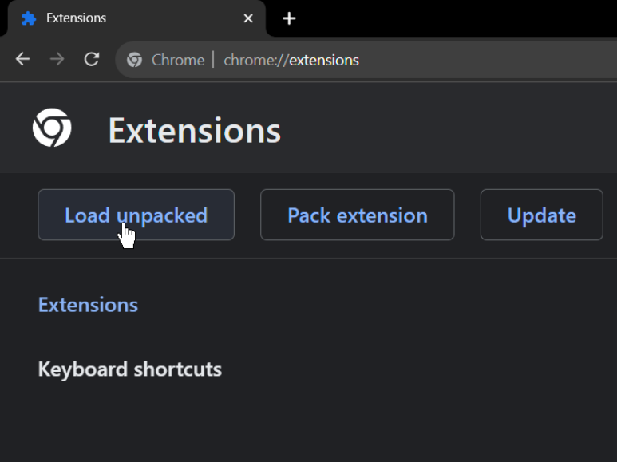
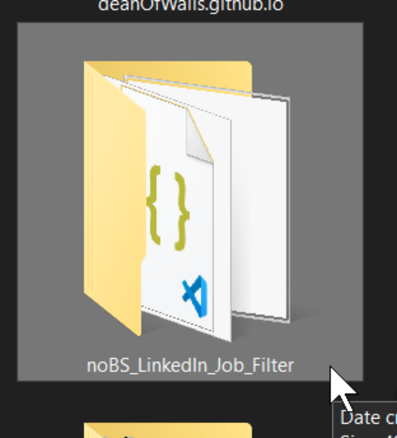
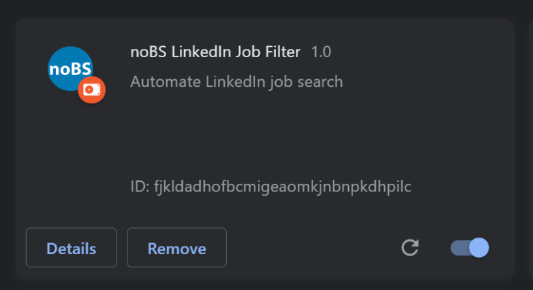
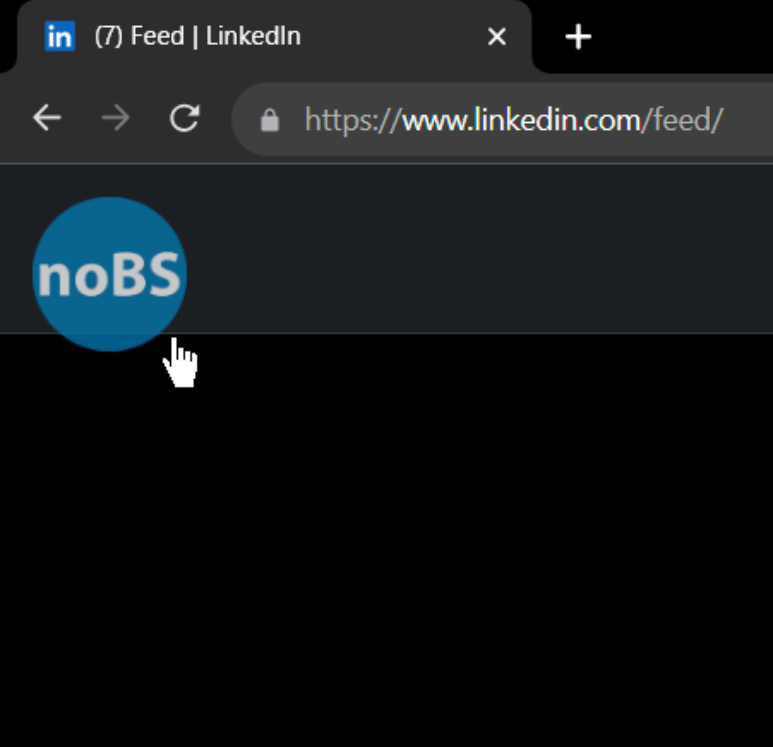
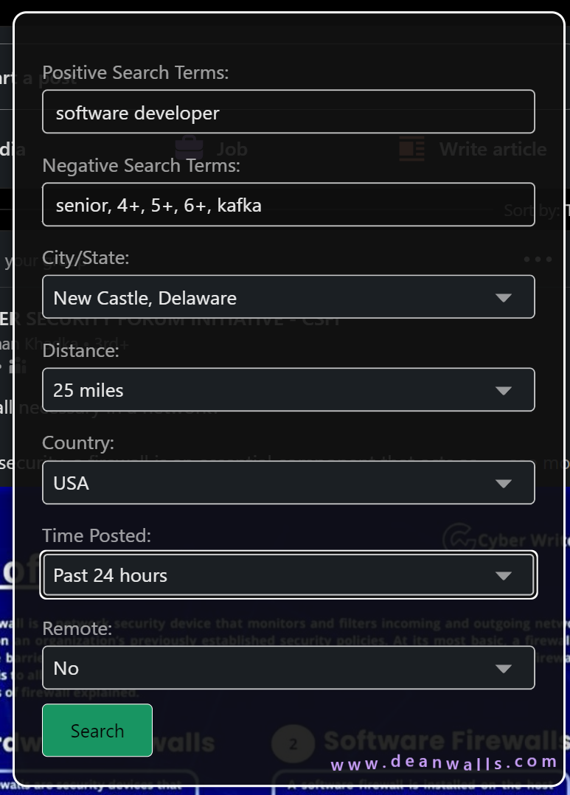

# noBS LinkedIn Job Filter

## Introduction

This Chrome extension is designed to help filter out non-entry-level jobs on LinkedIn, as the platform's native filtering system often falls short in this regard. It allows you to specify search terms, location, distance, and other parameters to find jobs that match your criteria. The extension also saves your preferences for future use. Unfortunately LinkedIn's search has not been working correctly, evidently as far back as 2015 [as evidenced here](https://www.linkedin.com/pulse/why-doesnt-linkedin-fix-search-issues-barbara-preston-phd/?trackingId=HaH4PJ1FRoSyrB%2BLJGA2Ww%3D%3D) 

## Quick Install

- [Chrome Web Store Link](https://chrome.google.com/webstore/detail/nobs-linkedin-job-filter/comlhlhadkibegigjnfebklaalpbphni?hl=en&authuser=2)

## Setup Instructions

### Step 1: Load the Extension

- Navigate to `chrome://extensions/` in your Chrome browser.
- Click on the "Load unpacked" button.

### Step 2: Select the Repository Folder

- Navigate to the folder where you have cloned or downloaded this repository.
- Select the folder and click "Open".

### Step 3: Enable the Extension

- Make sure the toggle next to the extension is in the "On" position to enable it.

### Step 4: Open the UI Panel

- After enabling the extension, you should see a UI button (usually at the top-right corner of your browser).
- Click on this button to open the UI panel.

### Step 5: Enter Your Search Terms

- The UI panel allows you to enter various search terms and parameters.
- After entering your desired terms, click on the "Search" button to execute the job search.

## Usage

Once the extension is set up, you can open the UI panel at any time by clicking the UI button. Enter your search terms and other parameters, and click "Search" to find jobs that match your criteria.

## Contributing

If you find any bugs or have suggestions for improvements, feel free to open an issue or submit a pull request.

## License

This project is licensed under the MIT License. See the [LICENSE](LICENSE) file for details.
